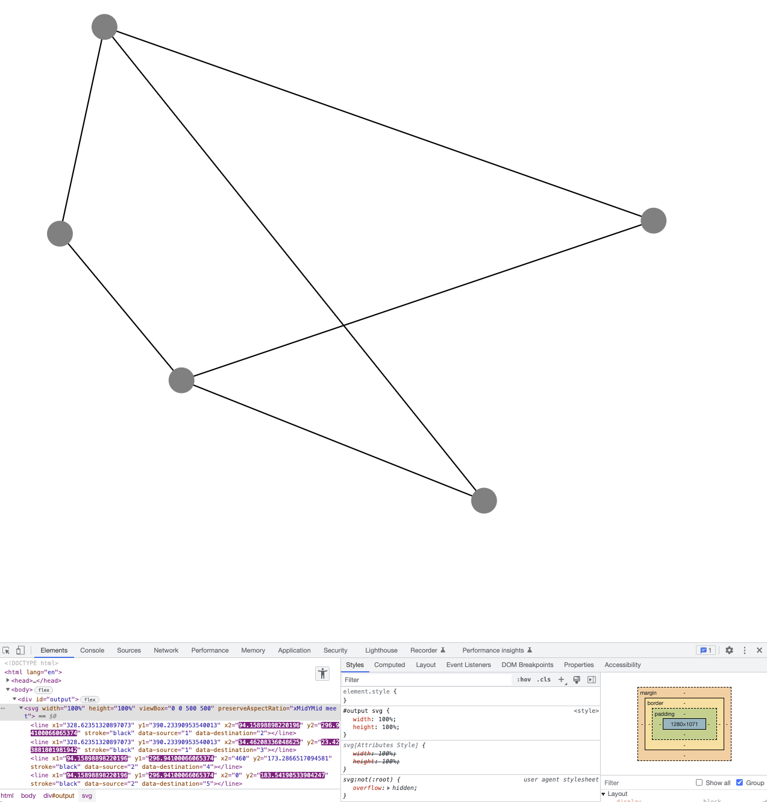

# GraphView for TypeScript

Fork of [GraphView](https://github.com/nabil6391/graphview) targeting TypeScript.

This implementation does not depending on rendering, instead just nodes and edges with positions.

## Features

- No dependencies
- TypeScript
- Example with SVG rendering

## FigJam

https://github.com/rodydavis/figjam-force-directed-graph
